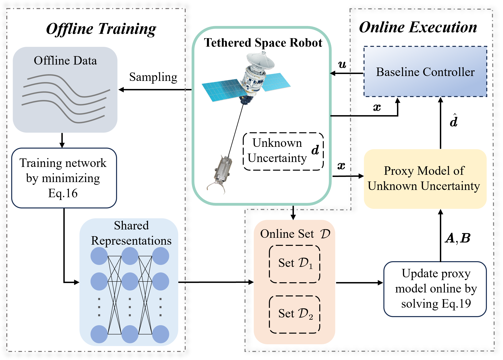

# DEKC: Data-Enable Control for Tethered Space Robot Deployment in the Presence of Uncertainty via Koopman Operator Theory

This repo contains the implementation of the paper "DEKC: Data-Enable Control for Tethered Space Robot Deployment in the Presence of Uncertainty via Koopman Operator Theory" by Ao Jin, Qinyi Wang, Sijie Wen, Ya Liu, Ganghui Shen, Panfeng, Huang and Fan Zhang*.

This work focuses the deployment of tethered space robot in the presence of unknown uncertainty. A data-enable framework called DEKC which contains offline training part and online execution part is proposed to deploy tethered space robot in the presence of uncertainty. The main idea of this work is modeling the unknown uncertainty as a dynamical system, which enables high accuracy and convergence of capturing uncertainty. The core part of proposed framework is a proxy model of uncertainty, which is derived from data-driven Koopman theory and is separated with controller design. In the offline stage, the lifting functions associated with Koopman operator are parameterized with deep neural networks. Then by solving an optimization problem, the lifting functions are learned from sampling data. In the online execution stage, the proxy model cooperates the learned lifting functions obtained in the offline phase to capture the unknown uncertainty. Then the output of proxy model is compensated to the baseline controller such that the effect of uncertainty can be attenuated or even eliminated. Furthermore, considering some scenarios in which the performance of proxy model may weaken, a receding-horizon scheme is proposed to update the proxy model online. Finally, the extensive numerical simulations demonstrate the effectiveness of our proposed framework.

Our paper: [link]

    

Coming soon.
